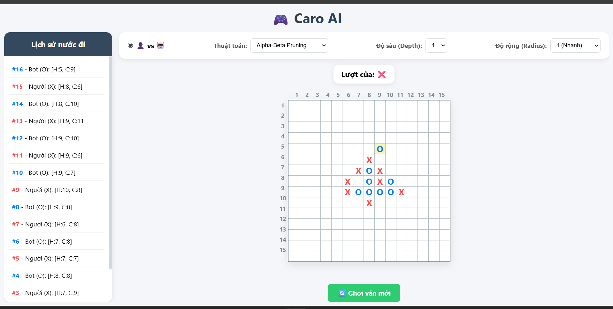

# Caro AI 15x15

This project is a **15x15 Caro (Gomoku) game with an AI opponent**.

- The **frontend** is a static HTML/CSS/JavaScript page.
- The **backend** is a FastAPI service.
- The **AI engine** supports `minimax`, `alpha-beta`, and `alpha-beta_v2`.

The current project structure is designed so that you only need:

1. Open `index.html` with **Live Server** in VS Code.
2. Run the FastAPI backend with Uvicorn on port `8222`.

## UI Preview



## Problem Statement

The goal of this project is to build a playable Caro board where:

- The human player uses `X`.
- The bot uses `O`.
- The board size is `15 x 15`.
- The frontend sends the current board state to the backend.
- The backend calculates the best next move using the selected AI algorithm.
- The frontend renders the bot move and continues the game.

## Project Structure

```text
Caro/
|-- main.py
|-- requirements.txt
|-- README.md
|-- caro-ui.png
`-- src/
    `-- caro/
        |-- __init__.py
        |-- config.py
        |-- ai/
        |   |-- __init__.py
        |   |-- helper.py
        |   |-- minimax.py
        |   |-- alpha_beta.py
        |   |-- alpha_beta_v2.py
        |   `-- bot_response.py
        `-- ui/
            |-- __init__.py
            |-- index.html
            `-- scripts.js
```

## What Each Part Does

### Backend

- `main.py`
  - Creates the FastAPI application.
  - Enables CORS so the frontend opened from Live Server can call the API.
  - Exposes:
    - `GET /`
    - `POST /bot-move`

- `src/caro/config.py`
  - Stores shared constants such as board size and player symbols.

### AI Logic

- `src/caro/ai/helper.py`
  - Board utilities, move generation, evaluation, win/terminal checks, and scoring helpers.

- `src/caro/ai/minimax.py`
  - Minimax search implementation.

- `src/caro/ai/alpha_beta.py`
  - Alpha-beta pruning implementation.

- `src/caro/ai/alpha_beta_v2.py`
  - Optimized alpha-beta version with caching and pruning statistics.

- `src/caro/ai/bot_response.py`
  - Chooses the move by calling the requested algorithm.

### Frontend

- `src/caro/ui/index.html`
  - Main game UI.
  - Renders the board, controls, and move history.

- `src/caro/ui/scripts.js`
  - Handles board interaction.
  - Sends requests to `http://127.0.0.1:8222/bot-move`.
  - Updates the UI with the bot response.

## Runtime Flow

1. Open the frontend with VS Code Live Server.
2. The page initializes a 15x15 board in the browser.
3. The player clicks a cell to place `X`.
4. The frontend sends the current board plus algorithm settings to `POST /bot-move`.
5. The backend receives the request in `main.py`.
6. `main.py` calls one of these functions:
   - `choose_best_move_by_minimax(...)`
   - `choose_best_move_by_alpha_beta(...)`
   - `choose_best_move_by_alpha_beta_v2(...)`
7. The backend returns the best `(row, col)` move.
8. The frontend places `O` on the board and continues the game.

## Requirements

The current `requirements.txt` already matches the external Python packages used by the project:

```text
fastapi
uvicorn
pydantic
```

No additional Python package is required based on the current imports in the repository.

## How To Run

### 1. Open the project folder

Project root on your machine:

```text
C:\Users\anhduc\WORKSPACE\CODE\Caro
```

Open this folder in VS Code.

### 2. Install Python dependencies

From the project root, run:

```bash
pip install -r requirements.txt
```

If you use Python 3 explicitly:

```bash
python -m pip install -r requirements.txt
```

### 3. Start the backend API

From:

```text
C:\Users\anhduc\WORKSPACE\CODE\Caro
```

run:

```bash
uvicorn main:app --reload --port 8222
```

Important:

- The correct Uvicorn target is `main:app`.


After startup, the backend will be available at:

```text
http://127.0.0.1:8222
```

Quick check:

```text
http://127.0.0.1:8222/
```

Expected response:

```json
{"message":"Caro AI API is running!"}
```

### 4. Open the frontend with Live Server

Frontend file path:

```text
C:\Users\anhduc\WORKSPACE\CODE\Caro\src\caro\ui\index.html
```

In VS Code:

1. Open the folder `C:\Users\anhduc\WORKSPACE\CODE\Caro`.
2. In the Explorer panel, go to `src > caro > ui > index.html`.
3. Right-click `index.html`.
4. Select **Open with Live Server**.

Typical Live Server URL:

```text
http://127.0.0.1:5500/src/caro/ui/index.html
```

Notes:

- The backend must be running before the bot can respond.
- `scripts.js` is hardcoded to call:

```text
http://127.0.0.1:8222/bot-move
```

## API Contract

### `GET /`

Health check endpoint.

Example response:

```json
{"message":"Caro AI API is running!"}
```

### `POST /bot-move`

Request body:

```json
{
  "board": [[".", ".", "."], [".", "X", "."]],
  "algorithm": "alpha-beta",
  "depth": 3,
  "radius": 2
}
```

Successful response:

```json
{
  "row": 7,
  "col": 8,
  "status": "success"
}
```

If no move is available:

```json
{
  "status": "no_moves_available"
}
```

## Important Paths

- Project root:
  - `C:\Users\anhduc\WORKSPACE\CODE\Caro`
- Backend entry:
  - `C:\Users\anhduc\WORKSPACE\CODE\Caro\main.py`
- Frontend entry:
  - `C:\Users\anhduc\WORKSPACE\CODE\Caro\src\caro\ui\index.html`
- Frontend script:
  - `C:\Users\anhduc\WORKSPACE\CODE\Caro\src\caro\ui\scripts.js`
- AI module folder:
  - `C:\Users\anhduc\WORKSPACE\CODE\Caro\src\caro\ai`

## Current Notes

- The frontend is served separately through VS Code Live Server.
- The backend only exposes API endpoints and does not serve static frontend files.
- CORS is enabled with `allow_origins=["*"]`, which is convenient for local development.
- The source files currently contain some text-encoding artifacts in comments and UI labels, but this does not change the basic run flow described above.
